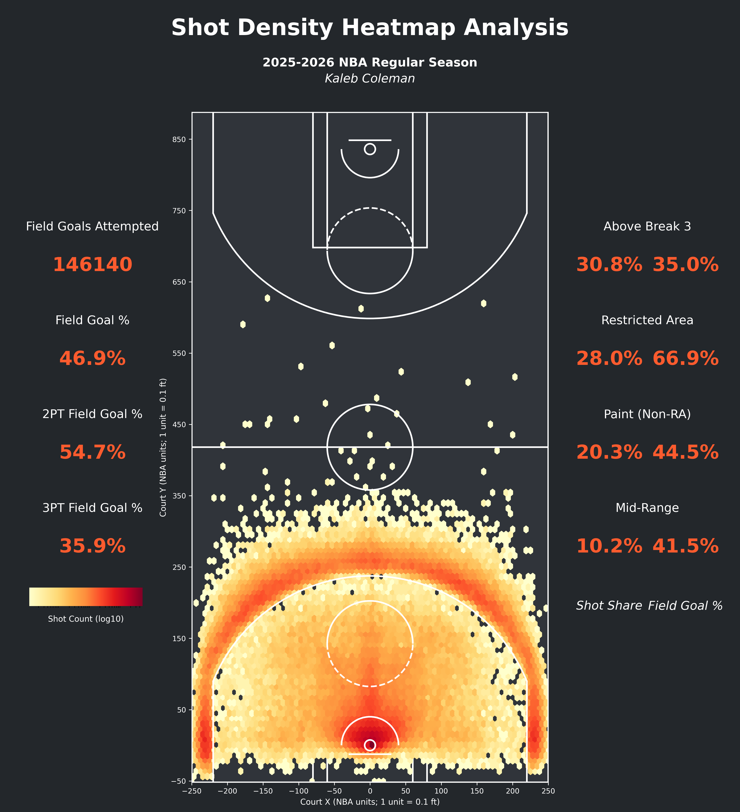

# NAU Capstone: NBA Expected Points Analysis

A comprehensive analysis of NBA shot quality, player performance, and value assessment using expected points modeling.



## Overview

This project analyzes NBA shot data to identify player performance beyond traditional metrics. Using expected field goal (xFG) models, we quantify how players perform relative to expectation.

### Key Metrics

| Metric | Description |
|--------|-------------|
| **xFG** | Expected field-goal probability from logistic regression model |
| **POE** | Points Over Expected at shot and player levels |
| **SDI** | Shot Difficulty Index based on distance, angle, clock, and shot type |
| **POE/$M** | POE per $1M salary for value context |

## Project Structure

```
nau-capstone/
├── docs/
│   └── proposal/
│       ├── Proposal.pdf
│       └── Proposal.Rmd
├── analysis/
│   └── nba/
│       ├── expected_points_analysis.py
│       ├── calibration_diagnostics.py
│       ├── gam_analysis.py
│       ├── advanced_analytics.py
│       ├── player_performance_analysis.py
│       ├── shot_density.py
│       ├── value_analysis.py
│       ├── app/
│       │   └── streamlit_app.py
│       ├── data/
│       ├── figures/
│       ├── models/
│       ├── utils/
│       └── requirements.txt
└── requirements.txt
```

## Quick Start

### 1. Install Dependencies

```bash
# From root
pip install -r requirements.txt

# Or from analysis/nba
cd analysis/nba
pip install -r requirements.txt
```

### 2. Run Analysis Scripts

```bash
cd analysis/nba

# Core expected points model
python expected_points_analysis.py

# Model calibration diagnostics
python calibration_diagnostics.py

# Generalized additive model analysis
python gam_analysis.py

# Advanced player analytics
python advanced_analytics.py

# Player performance analysis
python player_performance_analysis.py

# Shot density visualization
python shot_density.py

# Value analysis with salary data
python value_analysis.py
```

### 3. Launch Interactive Dashboard

```bash
streamlit run app/streamlit_app.py
```

## Key Visualizations

### Shot Difficulty Index (SDI) vs Expected FG%


The SDI metric quantifies shot complexity. Higher SDI = more difficult shot. Players above the trend line are overperforming expectations on difficult shots.

### Top Performers (2025-26 Season)

- **Luke Kennard**: +12.3% residual (elite shot-making)
- **Stephen Curry**: +8.7% residual
- **Nikola Jokic**: +7.2% residual

## Data Sources

- **NBA Stats API**: Official league data with optical tracking
- **ESPN API**: Supplementary player statistics
- **Player Salaries**: basketball-reference.com

## Models

- **xFG Model**: Logistic regression for expected field goal probability
- **GAM**: Generalized Additive Models for spatial analysis
- **GMM Clustering**: Gaussian Mixture Models for player archetypes

## Requirements

See `requirements.txt` for full dependency list:

- pandas, numpy, pyarrow (data processing)
- matplotlib, plotly, seaborn, streamlit (visualization)
- scikit-learn, joblib, pygam (machine learning)
- requests, beautifulsoup4 (data collection)

## License

NAU Capstone Project - Spring 2026