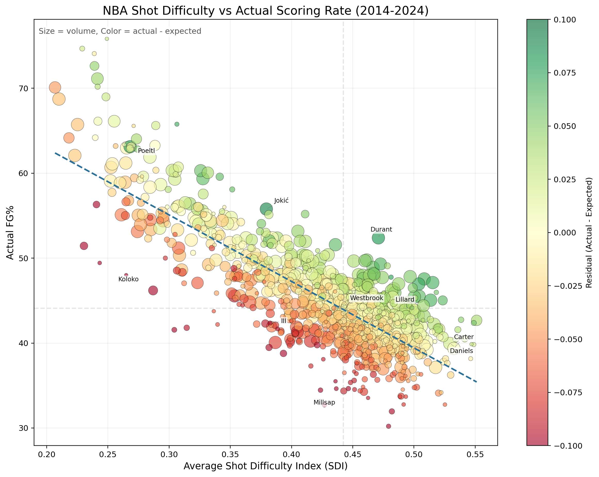

# NAU Capstone: Cross-Sport Shot Quality Analysis

This repository contains the final NAU capstone workflow for comparing shot difficulty and scoring expectation across the NBA and NHL.

The project has two deliverable surfaces:

- a `2014-2024` matched cross-sport analysis used for the final poster and written story
- a `2025-26` NBA Streamlit dashboard used as an interactive companion demo



## What The Project Does

The repo combines shot-level modeling, player summaries, and poster-ready figures to answer a shared sports analytics question:

How much of shooting efficiency is explained by shot difficulty, and where do players outperform or underperform expectation?

Core ideas used throughout the repo:

- `xFG` / `xG`: expected scoring probability for an individual shot
- `SDI`: Shot Difficulty Index summarizing how hard a player's shot diet is on average
- `Residual efficiency`: actual scoring rate minus expected scoring rate
- `GAM distance effect`: the marginal effect of shot distance after controlling for other context

## Final Deliverables

- [Poster guide](docs/final-poster-guide.md): maps each poster section to the files, figures, and tables that support it
- [Docs index](docs/README.md): quick index of proposal, comparison-story, and poster documentation
- [Matched comparison story](docs/proposal/Matched_Comparison_Story.Rmd): reproducible write-up for the final cross-sport narrative
- [NBA dashboard](analysis/nba/app/streamlit_app.py): interactive poster companion app

## Repository Layout

```text
nau-capstone/
├── analysis/
│   ├── nba/
│   │   ├── app/                         # Streamlit dashboard
│   │   ├── data/                        # NBA model outputs + poster tables
│   │   ├── figures/                     # NBA figures used in docs/dashboard
│   │   ├── models/                      # Saved NBA model artifacts
│   │   ├── cross_sport_comparison.py    # Matched NBA/NHL comparison pipeline
│   │   └── README.md
│   └── nhl/
│       ├── app/                         # NHL dashboard helpers
│       ├── data/                        # NHL model outputs + app data
│       ├── figures/                     # NHL figures used in docs/dashboard
│       ├── modeling.py                  # Shared NHL modeling helpers
│       ├── gam_analysis.py              # NHL expected-goal GAM workflow
│       ├── prepare_app_data.py          # NHL app-data prep
│       ├── SDI_METHODS.md               # NHL SDI method notes
│       └── README.md
├── data/                                # Top-level compressed archives for visitors
├── docs/
│   ├── README.md
│   ├── final-poster-guide.md
│   └── proposal/
└── requirements.txt
```

## Key Data Files

Top-level archives:

| Dataset | File | Notes |
| --- | --- | --- |
| NBA shot archive | [`data/nba_shots_2014_2024.csv.gz`](data/nba_shots_2014_2024.csv.gz) | Historical archive used for the matched cross-sport comparison |
| NHL shot archive | [`data/nhl_shots_2014_2024.csv.gz`](data/nhl_shots_2014_2024.csv.gz) | Historical archive used for the matched cross-sport comparison |

Primary poster/demo outputs:

| Output | File |
| --- | --- |
| Poster model snapshot table | [`analysis/nba/data/poster_model_snapshot.md`](analysis/nba/data/poster_model_snapshot.md) |
| NBA SDI figure | [`analysis/nba/figures/nba_sdi_vs_actual_2014_2024.png`](analysis/nba/figures/nba_sdi_vs_actual_2014_2024.png) |
| NHL SDI figure | [`analysis/nhl/figures/nhl_sdi_vs_actual_2014_2024.png`](analysis/nhl/figures/nhl_sdi_vs_actual_2014_2024.png) |
| NBA GAM distance figure | [`analysis/nba/figures/nba_gam_distance_2014_2024.png`](analysis/nba/figures/nba_gam_distance_2014_2024.png) |
| NHL GAM distance figure | [`analysis/nhl/figures/nhl_gam_distance_2014_2024.png`](analysis/nhl/figures/nhl_gam_distance_2014_2024.png) |

## Quick Start

Install the Python dependencies:

```bash
pip install -r requirements.txt
```

Run the NBA dashboard:

```bash
cd analysis/nba
streamlit run app/streamlit_app.py
```

Refresh the NHL app data:

```bash
cd analysis/nhl
python prepare_app_data.py
```

Refresh the matched cross-sport comparison outputs:

```bash
python analysis/nba/cross_sport_comparison.py
```

Refresh the poster snapshot table:

```bash
python analysis/nba/export_poster_snapshot.py
```

## Data Sources

- NBA Stats API / local `spatialSportsR` export for NBA shot data
- MoneyPuck for NHL shot data
- Basketball Reference salary data for NBA value context

## Notes For Final Presentation

- The final poster story should reference the matched `2014-2024` outputs, not the standalone `2025-26` NBA-only files.
- The dashboard is a companion surface, not the main source of record for the cross-sport comparison.
- NHL `xGoal` is preserved as a reference column in the data, but the repo-owned comparison outputs use the NHL GAM workflow in `analysis/nhl`.
