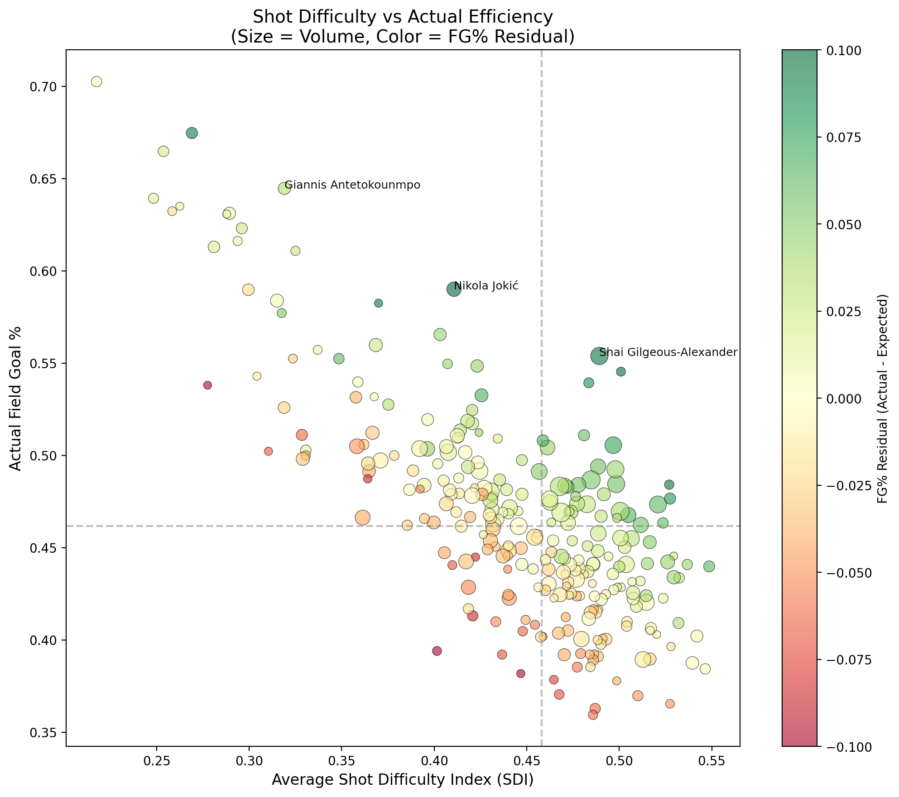

# NAU Capstone: Sports Shot Quality Analysis

A cross-sport NBA/NHL analysis repo focused on shot quality, scoring expectation, and difficulty-adjusted player performance.



## Overview

This project analyzes hockey and basketball shot data to identify player performance beyond traditional box-score metrics. The current repo contains:

- an NBA shot-quality pipeline with xFG-style expected make estimates, SDI diagnostics, and Streamlit exploration tools
- an NHL app-data prep flow plus NHL research/dashboard pages built from MoneyPuck shot data and shot-level `xGoal`
- a matched `2014-2024` NBA/NHL comparison pipeline that exports summaries, GAM-style distance effect figures, and proposal assets

### Key Metrics

| Metric | Description |
|--------|-------------|
| **xFG/xG** | Expected field-goal (NBA) / expected goal (NHL) probability |
| **POE** | Points/Goals Over Expected at shot and player levels |
| **SDI** | Shot Difficulty Index based on distance, angle, clock, and shot type |
| **POE/$M** | POE per $1M salary for value context |

## Project Structure

```
nau-capstone/
├── docs/
│   └── proposal/
│       ├── Proposal.pdf
│       └── Proposal.Rmd
├── analysis/
│   ├── nba/
│   │   ├── expected_points_analysis.py
│   │   ├── calibration_diagnostics.py
│   │   ├── gam_analysis.py
│   │   ├── advanced_analytics.py
│   │   ├── player_performance_analysis.py
│   │   ├── shot_density.py
│   │   ├── value_analysis.py
│   │   ├── app/
│   │   │   └── streamlit_app.py
│   │   ├── data/
│   │   ├── figures/
│   │   ├── models/
│   │   ├── utils/
│   │   └── requirements.txt
│   └── nhl/
│       ├── prepare_app_data.py
│       ├── capstonemodels.Rmd
│       ├── data/
│       ├── README.md
│       └── requirements.txt
└── requirements.txt
```

## Quick Start

### Install Dependencies

```bash
pip install -r requirements.txt
```

### NBA Analysis

```bash
cd analysis/nba
pip install -r requirements.txt

# Run analysis scripts
python expected_points_analysis.py
python calibration_diagnostics.py
python gam_analysis.py
python advanced_analytics.py
python player_performance_analysis.py
python shot_density.py
python value_analysis.py

# Launch dashboard
streamlit run app/streamlit_app.py
```

### NHL Analysis

```bash
cd analysis/nhl
pip install -r requirements.txt
python prepare_app_data.py
```

### Cross-Sport Comparison Outputs

```bash
python analysis/nba/cross_sport_comparison.py
```

## Data Sources

- **NBA Stats API**: Official league data with optical tracking (25fps)
- **MoneyPuck**: NHL shot data (2007-2024)
- **Player Salaries**: basketball-reference.com

## Models

- **xFG Model (NBA)**: Logistic regression for expected field goal probability
- **NHL Expected Goals**: Shot-level `xGoal` values from the MoneyPuck dataset, used directly in residual and SDI analysis
- **Distance Effect Model**: Spline-logistic distance curves with bootstrap confidence intervals for cross-sport comparison figures
- **GMM Clustering**: Gaussian Mixture Models for player archetypes

## Requirements

See `requirements.txt` for full dependency list:

- pandas, numpy, pyarrow (data processing)
- matplotlib, plotly, seaborn, streamlit (visualization)
- scikit-learn, joblib, pygam (machine learning)
- requests, beautifulsoup4 (data collection)

## License

NAU Capstone Project - Spring 2026
